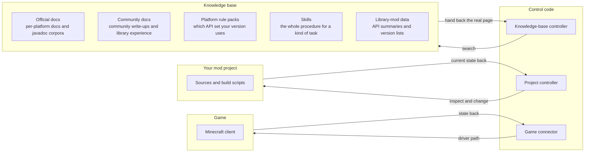

<div align="center">

<a href="https://github.com/guguzea/MC-AI-Coding-Assistant-Tool"></a>&nbsp;&nbsp;<a href="https://github.com/guguzea/MC-AI-Coding-Assistant-Tool"></a>&nbsp;&nbsp;<a href="https://github.com/guguzea/MC-AI-Coding-Assistant-Tool"></a>&nbsp;&nbsp;<a href="https://github.com/guguzea/MC-AI-Coding-Assistant-Tool"></a>&nbsp;&nbsp;<a href="https://github.com/guguzea/MC-AI-Coding-Assistant-Tool"></a><br />
[](https://github.com/guguzea/MC-AI-Coding-Assistant-Tool)&nbsp;&nbsp;[](README.en.md)&nbsp;&nbsp;[](AUTO_SETUP.md)<br />
[](LICENSE)&nbsp;&nbsp;[](community_knowledge/ATTRIBUTION.md)<br />
[](https://github.com/guguzea/MC-AI-Coding-Assistant-Tool/stargazers)&nbsp;&nbsp;[](https://github.com/guguzea/MC-AI-Coding-Assistant-Tool/forks)&nbsp;&nbsp;[](https://github.com/guguzea/MC-AI-Coding-Assistant-Tool/issues)&nbsp;&nbsp;[](https://github.com/guguzea/MC-AI-Coding-Assistant-Tool/commits)

</div>

<div align="center">

<br />
<br />


</div>

---

[简体中文](README_human.md) | **English**

[Technical docs & agent contract](README.en.md) · [Install & configure](AUTO_SETUP.md) · [Agent master guide](AGENTS.md) · [Changelog](mcp-server/CHANGELOG.md)

# For humans: what this toolset does for you

**What it can do, and how to start using it.**

The finer details — version lists, tool parameters, boundary conditions, measured results — all live in [README.en.md](README.en.md), which is the single source for technical facts and the contract the agent follows.

## Why I did not scrub the AI tone out of README, and why this text is not on the GitHub front page

When you open this project, the agent reads the README once. To work around the failure mode where an agent reads a long document and then quietly does nothing, I deliberately made README.md a thorough manual — which is exactly what makes it hard for a human to read. The result is a lot of text in README.md that does not read like a person wrote it (the classic tomato-and-egg stir-fry with no beef: all the right colours, none of the substance). So I moved the parts that actually matter onto this page. If you need the fine detail, ask your own AI assistant — that beats a human reading it.

1. The agent reads [README.en.md](README.en.md) first, so it has to be a complete specification.
2. To keep it readable, I split out the parts I think humans should read.
3. GitHub's README rendering is odd.

## In one sentence

AI coding assistants (Cursor, Claude Code, and others) stop guessing when they write Minecraft mods: they know which API set, build setup, and mapping layer your version uses — and they know which parts they have not verified.

## How it actually works for you



In plain words (in case the diagram does not render):

- The **knowledge base** holds five kinds of material: official docs (per-platform online docs and javadoc corpora for Forge / Fabric / NeoForge …), community docs (community write-ups, anti-patterns, library experience), platform rule packs (the constraints for which API set your version uses — this is what a session injects), Skills (the whole procedure for a kind of task), and library-mod data (API summaries and version lists for library mods). It only ever gets **read**; it never acts on its own.
- The **knowledge-base controller** is the hand AI uses to search it: the agent asks for something, the controller searches, reads out the real page, and hands it back. **The AI does not remember answers** — every answer comes from here, which is exactly why it cannot invent them.
- The **project controller** is the only hand that touches your files: it inspects and changes your mod project (reads `build.gradle`, validates registries, generates models / lang files / datapacks). By default it only **shows you**; actually writing to disk needs your go-ahead each time — which is why that arrow goes both ways: once a change lands, your project's **current state comes back** so the next round can judge it.
- The **game connector** is the third hand, the one that talks to the game. When a change has to be verified on a real client, it lets the AI drive the game through the driver path (walk somewhere, scan blocks, screenshot, collect evidence), and the state comes back so the agent can decide whether the change actually worked.

> For what exactly sits in each layer, see "Project layout" and "MCP/CLI TOOLS" in [README.en.md](README.en.md). "Control code" is the repo's `mcp-server/`; "your mod project" is your own mod's directory.

## Who it is for

- Mod developers who want fewer wrong answers from AI
- People letting AI edit code but worried it will invent method names
- Pack and server maintainers (dependency checks, crash triage)

## Three steps to start

1. **Install it**: build it and wire it into your AI host following [AUTO_SETUP.md](AUTO_SETUP.md) (Cursor / Claude Code / VS Code / Continue / Trae / OpenCode / Codex, and others). Node.js 22.5 or newer is required.
2. **Let it see your mod project**: open the project in your host. The agent identifies the platform and the exact version per [AGENTS.md](AGENTS.md), then loads the matching rule set into the conversation.
3. **Ask for what you need**: look up docs, generate code, triage a crash, or let it playtest inside the game. Anything that writes files, runs Gradle, copies jars, or uploads a release is shown to you first and waits for your confirmation.

## What it can do

### Platform rules and skills

Every platform and version ships its own rule set (registration, events, networking, data generation, anti-patterns, …) plus a batch of task-specific skill files. The agent loads **your** version's set, not a neighbouring one.

→ details in the "Agent Skills" and "Rule files" sections of [README.en.md](README.en.md)

### Official documentation search (works offline)

Forge / Fabric / NeoForge / Quilt / LiteLoader / Rift / Bedrock docs are fetched into a local corpus and searched with a mix of keyword and semantic ranking. Results come back as real page ids you can expand into a summary or the full text. No network needed. Which versions have data is recorded in the data packs.

→ details in "Notes on using the MCP tools" in [README.en.md](README.en.md)

### API, signatures, and mappings

Look up method signatures and parameter names for Vanilla APIs by class and method; look up loader and library APIs; convert class, method, and field names between mojang / MCP / Yarn / Parchment / obfuscated naming; and reverse a single obfuscated token from a crash log (`method_6032`, `er`, `func_110143_aJ`, …) back to a readable name. When a mapping layer is missing, it says so instead of passing an empty shell off as an answer.

→ details in "Mapping conversion" and "Tool boundaries" in [README.en.md](README.en.md)

### Access transformers, mixins, and resources

Bytecode-level validation of Access Transformer / Access Widener configs (Forge / NeoForge / Fabric), mixin injection-target analysis, data pack JSON validation, static audits of model and texture references, and resource pack format checks. There is also a workflow template library (new block / item / entity / GUI / worldgen / config / GameTest, …) where each template states the order of operations.

→ details in sections 9 and 10 of the tool reference in [README.en.md](README.en.md)

### Library mods: choosing and wiring them

Community-written notes on libraries such as Cloth Config, YACL, GeckoLib, JEI, Curios, and Kotlin for Forge, each saying when to use it, how to declare it, and which version traps exist. `check_dependencies` reads your `build.gradle` and metadata files and reports which libraries are declared and whether the version windows line up.

→ details in "Community knowledge and library mods" in [README.en.md](README.en.md)

### Code and resource generation

Skeletons for new blocks, items, entity renderers, worldgen, network packets, configs, language files, models, and blockstates. **Text output by default** — writing to disk needs your explicit confirmation. For third-party libraries (YACL and friends) you supply the jar, otherwise you get a structure shell explicitly marked unverified.

→ details in section 10 of the tool reference in [README.en.md](README.en.md)

### Diagnostics and crash triage

Parses crash reports, game logs, and Gradle build failures; infers missing prerequisites and version incompatibilities; checks dependency conflicts, project metadata, and mixin configs. On Bedrock it reads the content log.

→ details in sections 2 and 11 of the tool reference in [README.en.md](README.en.md)

### In-game playtesting

The unusual one: it can compile a temporary driver into your project so the agent **drives the game itself** — fly to a village, scan blocks, assert, screenshot, and leave structured evidence, then judge pass or fail from that evidence. Three routes are available: install a third-party bridge mod, run a scripted driver, or let the agent send intents live.

That said, I would not use this as a companion player: the implementation is a bit crude, so odd things happen now and then (it can grab your mouse cursor, for example).

→ details in "Mod testing loop" in [README.en.md](README.en.md)

### Porting

Porting a mod across loaders (Forge → NeoForge / Fabric and so on): identify the platform and mappings, list risks and steps, execute after you confirm. DryRun preview by default.

→ details in "Porting analysis" in [README.en.md](README.en.md)

### Localization

Extracts and diffs the language files of your mod or a third-party jar and drafts a Chinese version. **There is no machine translation** — it only marks the entries a human has to fill in.

→ details in the `localize_mod` section of [README.en.md](README.en.md)

### Command line

The whole toolset is also callable from a terminal or a script, with uniform JSON output and three exit-code classes (success / tool error / usage error), which makes it easy to wire into automation.

→ details in the "Standalone CLI" section of [mcp-server/README.md](mcp-server/README.md)

## Multi-IDE support

DSH support is in the works — it looks flexible enough that I want to customise it deeply.

```
platform/version/
├── .cursor/     → Cursor AI
├── .claude/     → Claude Desktop
├── .continue/   → Continue.dev
├── .trae/       → Trae AI
├── .opencode/   → OpenCode (skills; rules read from AGENTS.md)
├── .agents/     → Codex (skills; rules read from AGENTS.md)
├── .zcode/      → ZCode (skills; rules read from AGENTS.md)
└── .pi/         → Pi (rules/*.md)
```

## Hand-maintained files

The skill / rules / code-pattern files are maintained by hand, so the occasional problem is hard to avoid (1.20.1 and later have none that I know of). If something fails to compile or throws errors, trust the documentation first. You can also open an issue and I'll fix it as soon as I can. Thanks for understanding. Thanks♪(･ω･)ﾉ

## Where to look for what

| If you want | Go to |
|---|---|
| Install the MCP server, wire a host | [AUTO_SETUP.md](AUTO_SETUP.md) |
| The rules the agent follows | [AGENTS.md](AGENTS.md) |
| Tool list and parameters, supported versions, boundaries and pitfalls | [README.en.md](README.en.md) |
| Full CLI semantics | [mcp-server/README.md](mcp-server/README.md) |
| Community knowledge base (publishing, crashes, library choice) | [community_knowledge/README.md](community_knowledge/README.md) |
| Detailed playtest procedures | [community_knowledge/authored/ingame-playtest-automation.md](community_knowledge/authored/ingame-playtest-automation.md) |
| How to contribute a change | [CONTRIBUTING.md](CONTRIBUTING.md) |
| Licensing of third-party docs and data | [THIRD_PARTY_NOTICES.md](THIRD_PARTY_NOTICES.md) |

[简体中文](README_human.md) | **English**

## F&Q

1. **Q: 26.2 / 26.3 don't seem to have matching files — is that just not updated yet?**
   **A:** the major mod loaders ship no docs for 26.2 / 26.3 at the moment; for those versions we rely on the official 26.1 → 26.2 → 26.3 migration guide, so there is nothing to index. Once the official docs land, this gets updated to match.
2. **Q: Can playtesting support older versions?**
   **A:** it currently goes down to 1.20.1. Support for the flattening era (1.13+) comes after that; pre-flattening is genuinely hard and I'd rather not rush it.
3. **Q: Can playtesting support Bedrock?**
   **A:** Bedrock playtesting is still under development; this page gets updated once it lands.

#### Questions or problems — open an issue and I'll reply as soon as I can
