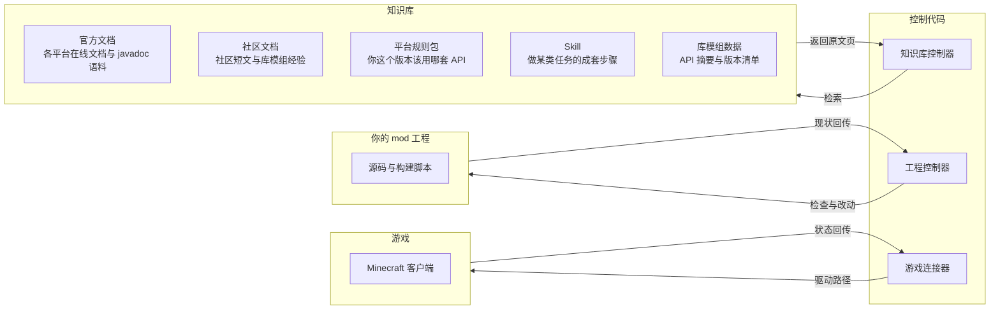

<div align="center">

<a href="https://github.com/guguzea/MC-AI-Coding-Assistant-Tool"></a>&nbsp;&nbsp;<a href="https://github.com/guguzea/MC-AI-Coding-Assistant-Tool"></a>&nbsp;&nbsp;<a href="https://github.com/guguzea/MC-AI-Coding-Assistant-Tool"></a>&nbsp;&nbsp;<a href="https://github.com/guguzea/MC-AI-Coding-Assistant-Tool"></a>&nbsp;&nbsp;<a href="https://github.com/guguzea/MC-AI-Coding-Assistant-Tool"></a><br />
[](https://github.com/guguzea/MC-AI-Coding-Assistant-Tool)&nbsp;&nbsp;[](README.md)&nbsp;&nbsp;[](AUTO_SETUP.md)<br />
[](LICENSE)&nbsp;&nbsp;[](community_knowledge/ATTRIBUTION.md)<br />
[](https://github.com/guguzea/MC-AI-Coding-Assistant-Tool/stargazers)&nbsp;&nbsp;[](https://github.com/guguzea/MC-AI-Coding-Assistant-Tool/forks)&nbsp;&nbsp;[](https://github.com/guguzea/MC-AI-Coding-Assistant-Tool/issues)&nbsp;&nbsp;[](https://github.com/guguzea/MC-AI-Coding-Assistant-Tool/commits)

</div>

<div align="center">

<br />
<br />


</div>

---

[English](README_human.en.md) | **简体中文**

[技术文档与 AI 契约](README.md) · [安装与配置](AUTO_SETUP.md) · [Agent 总纲](AGENTS.md) · [变更日志](mcp-server/CHANGELOG.md)

# 人类读本：这套工具能帮你做什么

**它能干什么，以及怎么开始用**。

详细的功能细节(如版本清单、工具参数、边界条件、实测数据)这些细节都在 [README.md](README.md)（那里是技术事实的唯一出处，也是 AI 的执行契约）。

## 其实我不太推荐去读readme细节,因为它真的非常长,在项目维护的时候也是直接扔给AI做的,导致README.md会出现非常多不说人话的情况(典型的番茄炒鸡蛋无牛肉版),所以我会把一些比较重要的内容放到这里,方便大家查看,如果你想要查看详细情况,你可以问问你的AI助手,这比人读好得多
    关于为什么我没有清理README.md的AI味和为什么不把人类读的放到github首页:
    1.安装本项目的时候AGENT会先读一次[README.md](README.md),为了解决部分AI注意力混乱,看了文档也不做的问题,我尽量把README做成一个详细的说明书(这也导致人的可读性非常低)
    2.为了保证可读性,我把我觉得人要看的单独分离出来了
    3.github奇怪的文档渲染机制

## 一句话

让 AI 编程助手（Cursor、Claude Code 等）写 Minecraft 模组时不再凭记忆猜：它知道你这个版本该用哪套 API、哪套构建配置、哪套映射，也知道哪些地方它没核实过。

## 它是怎么帮你干活的



人话版（万一张图没渲染出来）：

- **知识库** 存五类东西：官方文档（Forge / Fabric / NeoForge … 各平台的在线文档与 javadoc 语料）、社区文档（社区短文、反模式、库模组经验）、平台规则包（你这个版本该用哪套 API 的成套约束 —— 会话里注进来的就是它）、Skill（做某类任务的成套步骤）、库模组数据（库模组的 API 摘要与版本清单）。它只负责**被查**，不自己动手。
- **知识库控制器** 是 AI 查知识库的那只手：AI 问它要东西，它去检索、读出原文页再交回去。**AI 本身不记得答案** —— 答案永远来自这里，所以不会凭空编。
- **工程控制器** 是唯一会动你文件的那只手：它检查与改动你的 mod 工程（读 `build.gradle`、校验注册表、生成模型 / 语言文件 / 数据包）。默认**只给你看**，要真落盘得你逐次点头 —— 所以图里那条箭头是双向的：改动落地后，你工程的**现状会回传**，下一轮据此判断。
- **游戏连接器** 是第三只手，负责跟游戏说话：需要真机验证时，它通过驱动路径让 AI 去操作游戏（走位、扫描、截图、取证），再把状态回传，用来判断这次改动到底行不行。

> 想看每一层各自有哪些具体东西，见 [README.md 的「项目结构」与「MCP/CLI TOOLS」](README.md)。图中「控制代码」＝仓库里的 `mcp-server/`，「你的 mod 工程」＝你自己的模组项目目录。

## 适合谁

- 正在写模组，想让 AI 少给错答案的开发者
- 靠 AI 改代码，担心它编造方法名的开发者
- 整合包 / 服务端维护者（认依赖、查崩溃）

## 三步开始

1. **装上它**：按 [AUTO_SETUP.md](AUTO_SETUP.md) 编译并接入你的 AI 宿主（Cursor / Claude Code / VS Code / Continue / Trae / OpenCode / Codex 等）。需要 Node.js 22.5 或更高。
2. **让它认识你的模组工程**：宿主里打开工程即可，AI 会按 [AGENTS.md](AGENTS.md) 判断平台和精确版本，再把对应规则装进当前对话。
3. **干活**：查文档、生成代码、查崩溃、让它进游戏自己测——都是直接提问。涉及写文件、跑 Gradle、拷 jar、上传发布这类动作，它会先给你看清单再等你确认。

## 功能介绍

### 平台规则与技能

每个平台、每个版本都有一套规则（注册方式、事件、网络、数据生成、反模式……）和一批专用技能文件。AI 装规则时会用**你这个版本**的那一套，不会拿邻近版本糊你。

→ 细节见 [README.md 的「Agent Skills」与「规则文件说明」](README.md)

### 官方文档检索（离线可用）

把 Forge / Fabric / NeoForge / Quilt / LiteLoader / Rift / Bedrock 的官方文档抓到本地，按关键词与语义混合检索，返回的是**原文页 id**，可以继续读摘要或全文，不需要联网。版本清单和每个版本有哪些文档，都写在数据包里。

→ 细节见 [README.md 的「MCP 工具使用注意」](README.md)

### API、签名与映射查询

按类名和方法名查 Vanilla API 的方法签名与参数名；查加载器 / 库模组 API；把类名、方法名、字段名在 mojang / MCP / Yarn / Parchment / 混淆名之间来回转换；拿崩溃报告里的一个混淆 token（`method_6032`、`er`、`func_110143_aJ` 这类）反查回可读名字。映射层缺失时它会明说"没有索引"，不会拿空壳当答案。

→ 细节见 [README.md 的「映射转换」与「工具边界」](README.md)

### 错误代码与资源校验

字节码级校验 Access Transformer / Access Widener（Forge / NeoForge / Fabric）、分析 mixin 注入目标、校验数据包 JSON、静态审计模型与纹理引用、检查资源包格式。也提供工作流模板库（新建方块 / 物品 / 实体 / GUI / 世界生成 / 配置 / GameTest……），每条都写清先后顺序。

→ 细节见 [README.md 的工具参考 §9 / §10](README.md)

### 库模组知识与选型

社区整理的库模组短文（Cloth Config、YACL、GeckoLib、JEI、Curios、Kotlin for Forge……）与对应技能文件，说明每个库什么时候该用、怎么声明依赖、有哪些版本陷阱。`check_dependencies` 还能读你的 `build.gradle` / 元数据文件，告诉你声明了哪些库、版本窗口对不对。

→ 细节见 [README.md 的「社区知识与库模组」](README.md)

### 代码与资源生成

生成新方块、新物品、实体渲染器、世界生成、网络包、配置、语言文件、模型与 blockstate 的骨架代码。**默认只输出文本**，写盘要你显式确认。第三方库（YACL 之类）需要你提供 jar 才会给可编译的骨架，否则会明确标"未核实"。

→ 细节见 [README.md 的工具参考 §10](README.md)

### 诊断与崩溃分诊

解析崩溃报告、游戏日志、Gradle 构建失败日志；判断缺失前置与版本不兼容；检查依赖冲突、项目元数据、Mixin 配置。基岩端读 content log。

→ 细节见 [README.md 的工具参考 §2 / §11](README.md)

### 游戏内游玩自测

这是比较特别的一块：它能把一个临时 driver 编译进你的工程，让 AI **自己进游戏操作**——飞到某个村庄、扫描方块、断言结果、截图、留下结构化证据，然后根据证据判断过没过。支持三条路线：装第三方桥 mod、用脚本化剧本 driver、或让 AI 实时下意图。

当然,我并不推荐你将这个功能作为陪玩,主要是实现方式有点绿皮,导致偶尔会出现一些奇怪的问题(比如抢鼠标)

→ 细节见 [README.md 的「模组测试流程 loop」](README.md)

### 移植

把模组从 Forge 迁到 NeoForge / Fabric 这类跨加载器移植：识别平台与映射、给出风险与步骤、按确认执行。默认只做 dryRun 预览。

→ 细节见 [README.md 的「移植分析」](README.md)

### 汉化

把你的模组或第三方 jar 的语言文件抽出来、对比缺失项、生成中文草稿。**没有机器翻译**，它只标出哪些条目需要人填。

→ 细节见 [README.md 的 `localize_mod` 说明](README.md)

### 命令行入口

整套工具也能直接在终端 / 脚本里用，输出统一 JSON、退出码分成功 / 工具错误 / 用法错误三档，方便接自动化。

→ 细节见 [mcp-server/README.md 的「独立 CLI」](mcp-server/README.md)

## 多 IDE 支持

另外,DSH的支持正在做(DSH看起来非常自由,我打算深度定制一下)

```
平台/版本/
├── .cursor/     → Cursor AI
├── .claude/     → Claude Desktop
├── .continue/   → Continue.dev
├── .trae/       → Trae AI
├── .opencode/   → OpenCode（skills；规则读 AGENTS.md）
├── .agents/     → Codex（skills；规则读 AGENTS.md）
├── .zcode/      → ZCode（skills；规则读 AGENTS.md）
└── .pi/         → Pi（rules/*.md）
```

—                 |
## skill/rules/代码模式库等文件由于上游文档错误(说的就是forge,1.20.4还在教1.20.1的东西),人工维护等问题,难免出现一点问题(1.20.1+应该没有问题了),如发现无法编译,报错,可以优先以文档为主,你也可以提交issue,我会尽快修复,谢谢您的理解Thanks♪(･ω･)ﾉ

## 在哪找什么

| 你想找的东西 | 去哪 |
|---|---|
| 装 MCP、接宿主 | [AUTO_SETUP.md](AUTO_SETUP.md) |
| AI 的执行规则（什么能做、什么要问） | [AGENTS.md](AGENTS.md) |
| 工具清单与参数、版本支持表、边界与陷阱 | [README.md](README.md) |
| CLI 完整语义 | [mcp-server/README.md](mcp-server/README.md) |
| 社区知识库（发布、崩溃、库选型） | [community_knowledge/README.md](community_knowledge/README.md) |
| 游戏内自测的详细规程 | [community_knowledge/authored/ingame-playtest-automation.md](community_knowledge/authored/ingame-playtest-automation.md) |
| 怎么给仓库提改动 | [CONTRIBUTING.md](CONTRIBUTING.md) |
| 第三方文档与数据的许可 | [THIRD_PARTY_NOTICES.md](THIRD_PARTY_NOTICES.md) |

[English](README_human.en.md) | **简体中文**

## F&Q
1. Q: 26.2/26.3看上去好像没有对应文件呀,是还没有更新吗?
   A:26.2/26.3主要模组加载器没有任何文档,现在主要依靠官方的26.1->26.2->26.3的版本迁移文档,所以没有对应的文档,等官方文档更新后会同步更新
2. Q:游玩自测可以支持一下老版本吗?
   A:目前支持到1.20.1+,后面会做扁平化之后(1.13+)的支持,扁平化之前的真的不是很好做,先不急吧
3. Q:游玩自测可以支持基岩端吗?
   A:基岩端的游玩自测目前还在开发中,等开发完成后会同步更新
4. Q:为什么有这么多工具,看上去好多可以合并
   A:为了保证项目的灵活性,每个部分都是单独可拆的,你只需要保留你需要的部分,其他的可以删除来节省空间,而为了可拆,工具就变得非常多了
   (其实是部分内容拆了之后会导致合并工具出现一些妙妙BUG)
#### 有问题可以提issue与讨论,我会尽快回复
## 可以进来玩玩:

